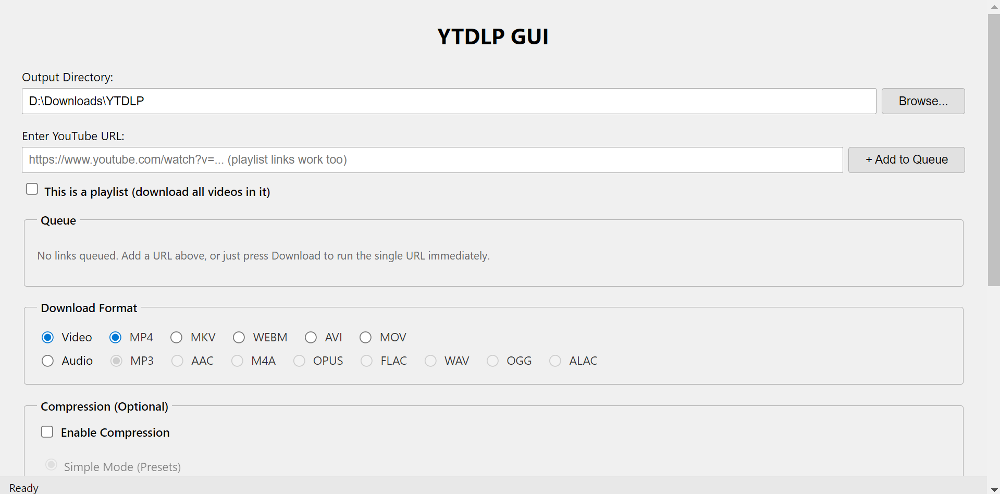
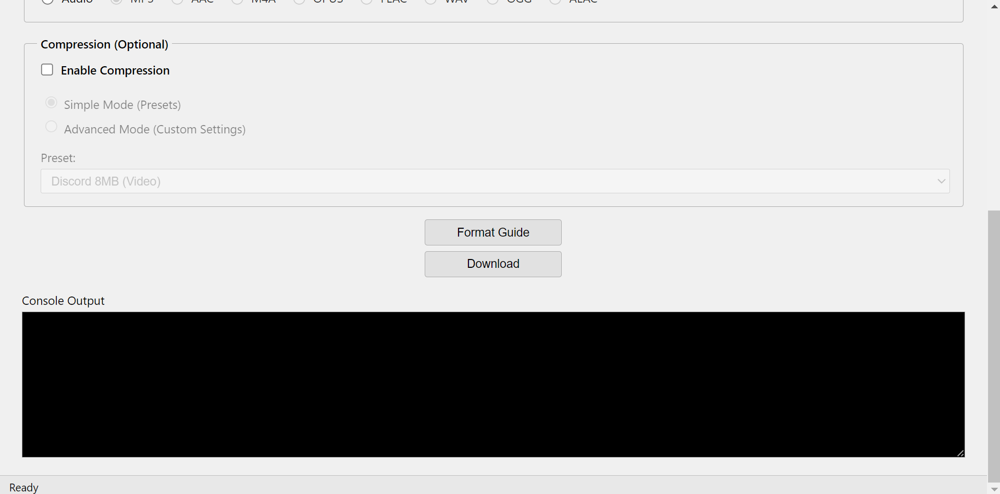
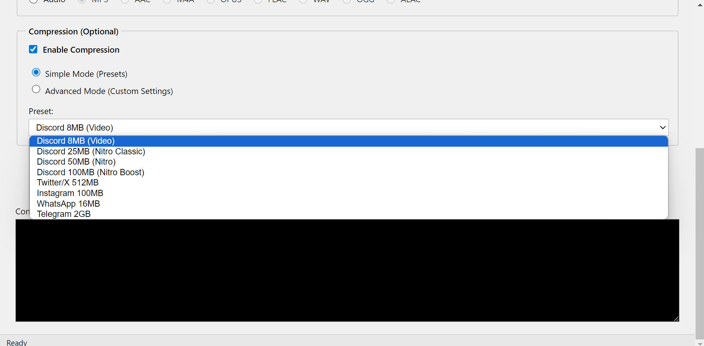
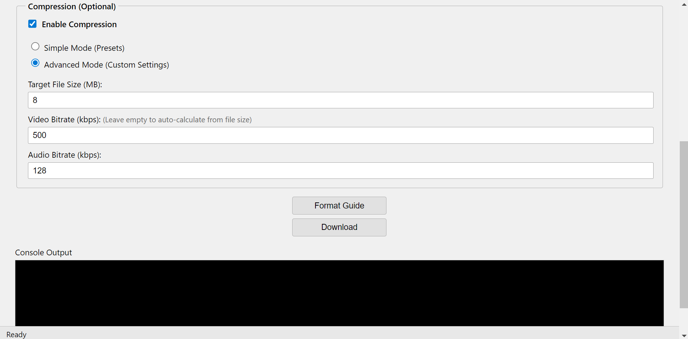

# YTDLP-GUI

This app was made with the help of AI. YTDLP-GUI is a free, open-source GUI for downloading and converting YouTube videos, built with Electron using yt-dlp and ffmpeg. Released under GPLv3 to keep it free for everyone, forever.



## Features
- ⬇️ Download videos from YouTube (and other yt-dlp supported sites)
- 🎞️ Convert to your preferred format
- 🔒 No accounts, no cloud, no subscriptions — everything stays local
- 🌱 Completely free — no microtransactions, no paywalls

## More screenshots
<details>
<summary>Click to expand</summary>
<table>
  <tr>
    <td></td>
    <td></td>
    <td></td>
  </tr>
</table>
</details>

## Download
Grab the latest Windows installer from the [Releases page](../../releases). Download, run `YTDLP-GUI-Setup.exe`, and follow the prompts.

## Building from source
```bash
git clone https://github.com/HagHagson/YTDLP-GUI.git
cd YTDLP-GUI
npm install
npm start
```

To build the installer yourself:
```bash
npm run dist
```

## License
[GPLv3](LICENSE) — free and open, forever. Modifications and forks must also stay open source.

## Contributing
Issues and pull requests are welcome. If you're planning a large change, consider opening an issue first to discuss it.
